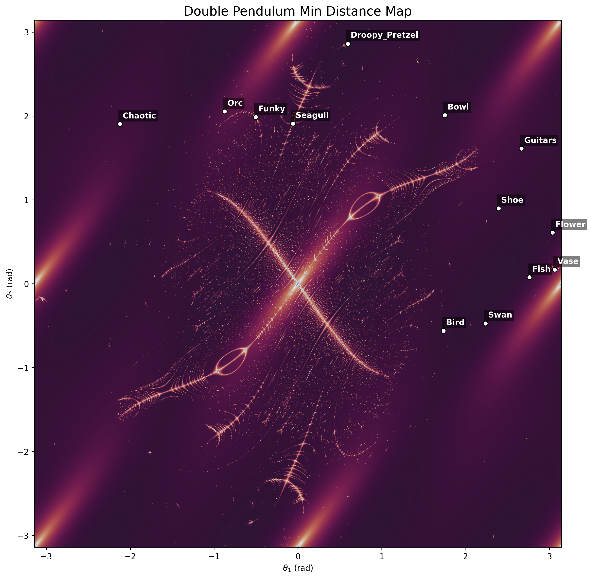
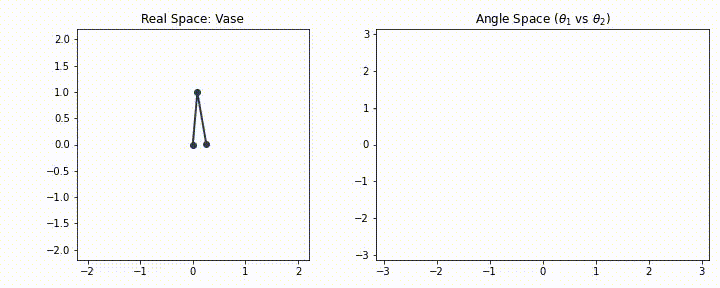
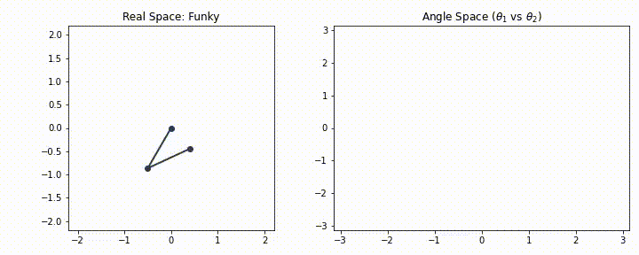
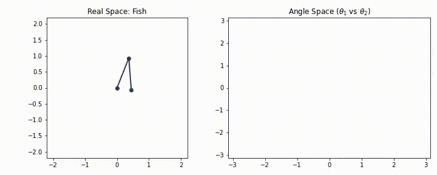
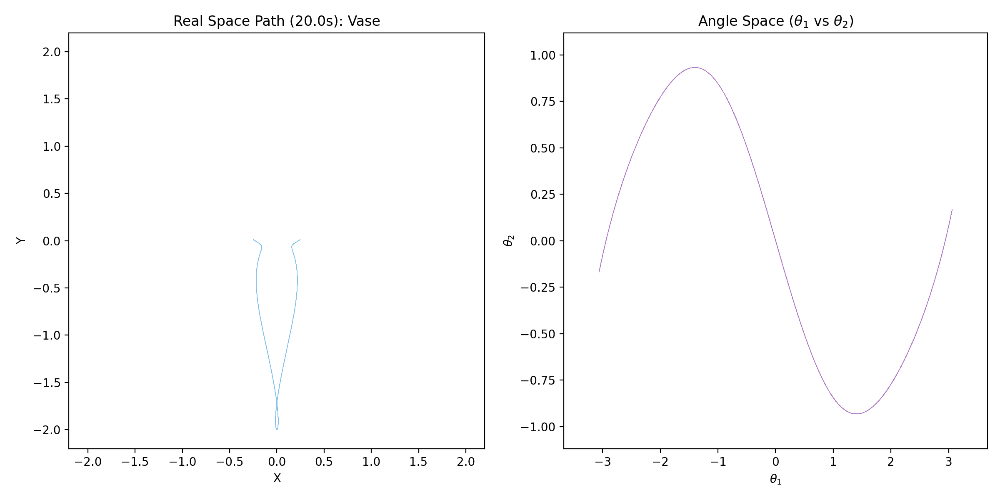
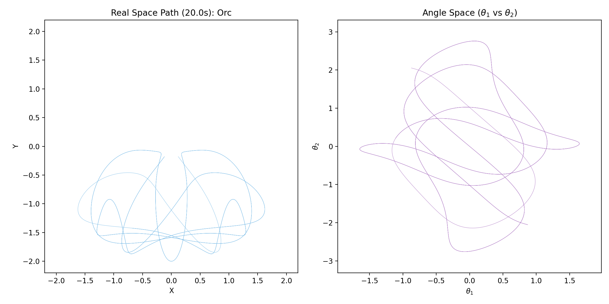

# Double Pendulum Chaos Explorer

This project provides a GPU-accelerated environment for analyzing the chaotic dynamics of the Double Pendulum. It generates high-resolution Lyapunov stability, Poincaré recurrence, and Minimum Distance fractals, exploration of phase space, and the sonification of chaotic trajectories through simulation

The project implements findings and concepts from the video ["Double Pendulums are Chaoticn't"](https://www.youtube.com/watch?v=dtjb2OhEQcU) by [2swap](https://www.youtube.com/@twoswap)

## Features

### GPU-Accelerated Fractal Engines
The application uses **Taichi Lang** to simulate hundreds of thousands of pendulums in parallel:
*   **Lyapunov Stability Map:** Measures sensitivity to initial conditions (Chaos). This replicates the method used in the 2swap video
*   **Poincaré Recurrence Map:** Measures how closely a trajectory returns to its own starting state (Periodicity) over time
*   **Min Distance Map:** A higher contrast version of the Poincaré map, measuring the minimum distance between a trajectory and its initial state

### Interactive Phase Space Explorer (`visualizer.py`)
A graphical interface built with Matplotlib to view the system:
*   **Fractal Rendering:** Zooming into any map maintains high resolution at any depth
*   **Dynamic Scaling:** Angle Space graphs automatically scale to fit the trajectory data perfectly
*   **Colormap Toggle:** Invert the colormap to highlight different features of the chaos
*   **Best Point Finder:** Automatically jumps to the point with the highest score in the current view
*   **Trajectory Solving:** Toggle animation for real-time physics or full-path

### Batch Rendering & Visualization (`generate_visuals.py`)
Generates videos for specific points of interest:
*   **Combined Video Rendering:** Renders `.mp4` files with physics and phase plots
*   **Map Exports:** Generates high-resolution PNGs for Stability, Periodicity, Min-Distance, and Overlays
*   **Trajectory Path Maps:** Saves static PNGs showing the full journey in both Real Space and Angle Space
*   **Standardized Naming:** All outputs are organized and named logically for easy navigation

### Physics Sonification (`audio.py`)
Interprets the geometry of the pendulum's motion as sound:
*   **Stereo Mapping:** Interprets $\theta_1$ as the Left channel and $\theta_2$ as the Right channel
*   **Time Compression:** Simulation is solved faster than real-time for audio, shifting frequencies into the audible range
*   **High-Resolution Analysis:** Also has separate audio processing to ensure smooth, artifact-free sound with fft

## Installation

The project was tested with Python 3.12 on Windows 10 and a GPU-capable environment for Taichi (CUDA, Vulkan, Metal, or DirectX).

1.  Clone the repository.
2.  Install requirements:
```bash
pip install -r requirements.txt
```

## Usage

### Interactive Exploration
Launch the GUI explorer:
```bash
python visualizer.py
```
Select your **Metric** (Lyapunov, Poincaré, or MinDist) and **Space** (Angle or Momentum) in the terminal menu

### Generating Media
To render all maps and videos:
```bash
python generate_visuals.py
```
*   `visuals/`: Contains `.png` maps and `.mp4` video files.
*   `audio/`: Contains the corresponding `.wav` audio files.

## Technical Details

### Physics Implementation
*   **Integrator:** Fixed-step Runge-Kutta 4 (RK4) for balanced speed and accuracy.
*   **Simulation Scaling:** `ti.f32` precision with heavy parallelization on the GPU.

### Fractal Algorithms
1.  **Lyapunov Divergence:**
  *   **Logic:** Tracks divergence between a pendulum and a "shadow" twin offset by $10^{-5}$ rad.
  *   **Result:** Bright regions = Chaos; dark regions = Stability.
2.  **Poincaré Recurrence:**
  *   **Logic:** Measures how well the system returns to its initial state using continuous sampling.
  *   **Result:** Highlights periodic orbits.
3.  **Min Dist (Classic Fractal):**
  *   **Logic:** Tracks the absolute minimum distance to the origin throughout the entire simulation.
  *   **Result:** Extremely sharp, high-contrast resonance structures.

### Gallery

#### Stability Map (Lyapunov)


#### Periodicity Map (Poincaré)


#### Min Distance Map (Classic)


#### Overlay (Stability + Min Dist)


#### Rendered Examples




#### Trajectory Path Maps




## Credits
* **Original Concept:** [2swap](https://www.youtube.com/@twoswap)
* **Resource:** [swaptube](https://github.com/2swap/swaptube)
